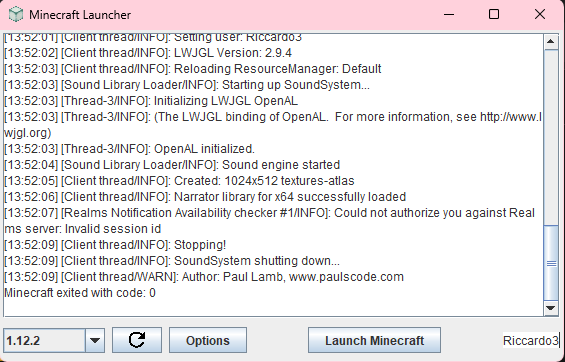

# Minecraft Launcher
A Java 8 compatible custom Minecraft launcher, with support for offline accounts.

## Usage
Download [latest build](https://github.com/rosalinaowo/MinecraftLauncher/releases)'s LauncherGUI.jar or use the [standalone jars](#standalone-jars)

### Standalone jars
Download Minecraft:
```bash
java -jar Downloader.jar [options] [version] [destination path]
```
e.g. ```java -jar Downloader.jar 1.8.9 .```

Launch the game:
```bash
java -jar Launcher.jar [options] [version] [username]
```
e.g. ```java -jar Launcher.jar 1.8.9 pino```

## Features
- Offline account support
- Automatic JRE download
- Automatic assets and libraries download
- Multiple game versions
- Custom launch options and memory amount

## Building
- **Automatic**: Open the project with IntelliJ Idea, click `Build -> Build Project` and run `out/artifacts/LauncherGUI.jar`
- **Manual**: Install your desired JDK version and clone this repository, run the build script (**Important**: set your Java binaries path in build.bat).

## Screenshots



## Disclaimer
This project should be used for educational porpuses only and comes as is, providing no warranty.
[GPL-2.0 License](./LICENSE)